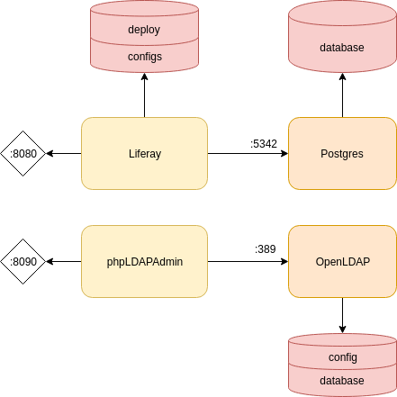

# Liferay Portal for dev and test purpose

This repository is an example of deploymemnt of a liferay portal into docker.

The base image used for liferay is : mdelapenya/liferay-portal:7.1.2-ga3, it uses liferay portal 7.1.2 with Tomcat 8 as application server.

Postgres is used as database for Liferay, and could also be used for other services. In real world, it will be more pertinent to have a database instance per services.

An OpenLDAP server is also added, with an admin interface (phpLDAPAdmin). This server could be used to authenticate users into Liferay, but not yet configured, or by other services and portlets.

The databases (postgres and OpenLDAP) are available to an internal network, to prevent external access.

